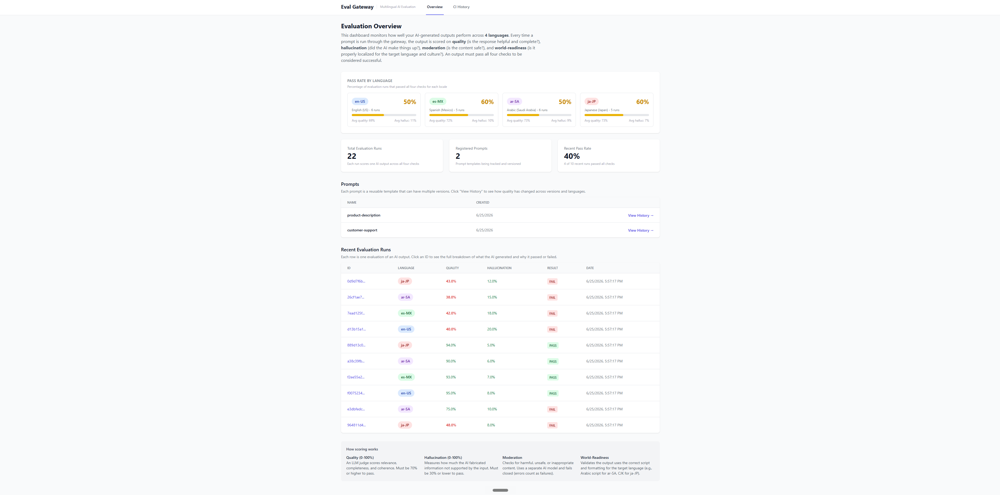
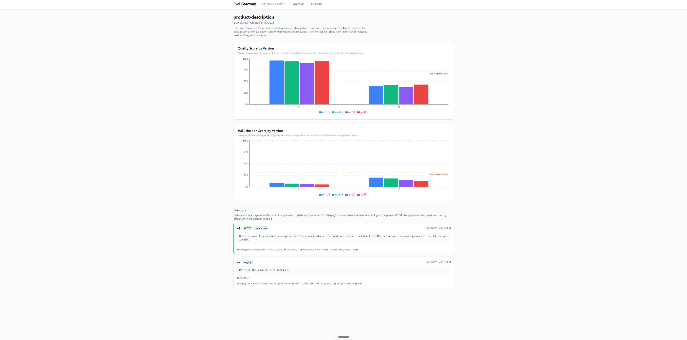

# Multilingual GenAI Evaluation & Moderation Gateway

## Why this project exists

When companies deploy AI-powered features across multiple languages, they face a hard problem: how do you know if the AI's output is actually good in Spanish, Arabic, or Japanese? English outputs might look fine, but translated or multilingual outputs can silently degrade in quality, hallucinate facts, produce culturally inappropriate content, or fail to use the correct script entirely.

This project solves that problem. It is a complete evaluation and moderation pipeline that automatically scores AI outputs across 4 languages, catches quality regressions before they ship, and provides a visual dashboard so teams can monitor how their prompts perform over time.

## What it does

1. **You send a prompt name, user input, and target language** to the gateway API
2. **The gateway generates an AI response** using Claude (Anthropic's LLM)
3. **Four independent checks score the output:**
   - **Quality**: An LLM judge scores relevance, completeness, and coherence (0-100%, must be 70%+)
   - **Hallucination**: Detects fabricated or unsupported claims (0-100%, must be 30% or lower)
   - **Moderation**: Checks for harmful or unsafe content (pass/fail, errors default to fail)
   - **World-Readiness**: Validates correct script, text direction, and formatting for the target language
4. **The result is stored** with full reasoning, and a pass/fail verdict is returned
5. **A CI gate** compares new prompt versions against production baselines and blocks regressions
6. **A React dashboard** visualizes all of this with charts, drill-down views, and explanations

## Supported Languages

| Locale | Language | What world-readiness checks |
|--------|----------|----------------------------|
| `en-US` | American English | Latin script present, no foreign script leaks, US number/date formatting |
| `es-MX` | Mexican Spanish | Latin script + Spanish diacritics, no foreign script contamination |
| `ar-SA` | Saudi Arabic | Arabic script present, right-to-left text direction, detects untranslated English |
| `ja-JP` | Japanese | CJK script (Hiragana/Katakana/Kanji) present, detects untranslated English |

## Architecture

```
                     React Dashboard (:5173)
                     Overview | Prompt History | Eval Detail | CI History
                            |
                            | /api/*
                            v
                     FastAPI Backend (:8000)
                            |
          +-----------------+-----------------+
          |                 |                 |
     Prompt Registry   Gateway Pipeline   CI Gate
     (CRUD, versions,  (the core flow)    (regression
      dedup, labels,        |              detection)
      rollback, diff)       |
                            v
                  1. Generate output (Claude Sonnet)
                            |
                  2. Quality judge (Claude Sonnet)
                            |
                  3. Hallucination judge (Claude Sonnet)
                            |
                  4. Moderation check (Claude Haiku, fail-closed)
                            |
                  5. World-readiness validation (rule-based, per locale)
                            |
                  6. Store EvalRun + return pass/fail
                            |
                     PostgreSQL / SQLite
```

## Quick Start (Local, no Docker needed)

### Prerequisites

- Python 3.10+
- Node.js 18+
- An Anthropic API key (optional for demo; seed data works without one)

### 1. Clone the repo

```bash
git clone https://github.com/shyam-kannan/Multilingual_GenAI_Evaluation.git
cd Multilingual_GenAI_Evaluation
```

### 2. Start the backend

```bash
cd backend
pip install -r requirements.txt
```

Create a `.env` file in the `backend/` directory:

```
DATABASE_URL=sqlite:///eval_gateway.db
ANTHROPIC_API_KEY=your-key-here
ENVIRONMENT=development
```

Start the server:

```bash
uvicorn app.main:app --host 0.0.0.0 --port 8000
```

The backend auto-creates SQLite tables on startup. Visit http://localhost:8000/health to confirm.

### 3. Seed demo data

In a separate terminal:

```bash
pip install requests
python scripts/seed.py
```

This creates 2 prompts, 4 versions, 8 golden examples, 24 eval runs, and 3 CI runs with realistic multilingual data, including:

- A failing Arabic evaluation (English output returned for an Arabic locale, caught by world-readiness)
- A prompt regression (v2 quality dropped 40%+ vs production v1)
- CI runs showing the regression being detected and blocked

### 4. Start the frontend

```bash
cd frontend
npm install
npx vite
```

Open http://localhost:5173 to see the dashboard.

### Using Docker Compose instead

```bash
cp .env.example .env
# Edit .env with your ANTHROPIC_API_KEY
docker compose up --build
```

This starts PostgreSQL, the backend (with auto-migration), and the frontend.

## Dashboard Pages

### Overview (Landing Page)

The main dashboard gives you an at-a-glance view of how your AI outputs are performing across all four languages. At the top, it explains what the system does and what each metric means. The "Pass Rate by Language" cards show what percentage of evaluations passed all four checks for each locale, with progress bars and average scores. Below that, summary stats show total runs, registered prompts, and the recent pass rate. The prompts table links to version history, and the recent runs table lets you click into any individual evaluation. A "How scoring works" section at the bottom defines each metric.



### Prompt History (Version Comparison)

When you click "View History" on a prompt, this page shows how output quality has changed across prompt versions and languages. The top bar chart compares average quality scores per language for each version, with a yellow dashed line marking the 70% pass threshold. A second chart does the same for hallucination scores (with a 30% fail threshold). Below the charts, each version card shows the prompt template text, labels (production/staging), and per-locale quality and hallucination percentages color-coded green (passing) or red (failing). You can also diff two versions to see exactly what changed in the prompt text.



### Eval Run Detail

When you click any run ID from the overview table, this page shows the full evaluation of a single AI response. It displays the original input and the AI's generated output side by side, followed by four score cards: Quality, Hallucination, Moderation, and World-Readiness. Each card shows the score, the pass/fail threshold, the judge's reasoning, and a collapsible raw details section.

### CI History

Lists all CI regression checks with pass/fail status, detected regressions, and per-language score breakdowns. Each failed run shows exactly which languages regressed and by how much (e.g., "en-US quality: baseline 90% to candidate 50%, delta -40%"). A "How CI regression detection works" section at the bottom explains the four-step process.

## API Endpoints

### Health
```
GET /health
```

### Prompts
```
POST   /api/prompts                                     Create prompt
GET    /api/prompts                                     List prompts
GET    /api/prompts/{id}                                Get prompt + versions
POST   /api/prompts/{id}/versions                       Create version (content-hash dedup)
PATCH  /api/prompts/{id}/versions/{vid}/activate        Set as active
PATCH  /api/prompts/{id}/versions/{vid}/labels          Update labels
POST   /api/prompts/{id}/rollback/{vid}                 Rollback to version
GET    /api/prompts/{id}/diff/{v1_id}/{v2_id}           Diff two versions
```

### Golden Sets
```
POST   /api/golden-sets                    Create golden example
GET    /api/golden-sets?prompt_id=&locale=  List (filterable)
PUT    /api/golden-sets/{id}               Update
DELETE /api/golden-sets/{id}               Delete
```

### Gateway (core evaluation pipeline)
```
POST /api/gateway/run
Body: {"prompt_name": "...", "input": "...", "locale": "en-US"}
Returns: eval_run_id, all scores, pass/fail, detailed reasoning
```

### Eval Runs
```
GET /api/eval-runs?locale=&passed=&limit=   List with filters
GET /api/eval-runs/{id}                     Full detail
```

### CI Gate
```
POST /api/ci/check
Body: {"prompt_name": "...", "locales": ["en-US", "es-MX", "ar-SA", "ja-JP"]}
Returns: passed/failed, list of regressions, ci_run_id
```

### Dashboard Data
```
GET /api/dashboard/overview                 Per-locale stats, recent runs
GET /api/dashboard/prompts/{id}/history     Score trends across versions
GET /api/dashboard/ci-history               Recent CI runs
```

## Running Tests

```bash
# Backend (79 tests, uses in-memory SQLite, all LLM calls mocked)
cd backend
pytest tests/ -v

# Frontend (11 tests)
cd frontend
npx vitest run
```

## Tech Stack

| Layer | Technology |
|-------|-----------|
| Backend | Python, FastAPI, SQLAlchemy, Alembic, Pydantic |
| Database | PostgreSQL (production), SQLite (local dev and tests) |
| LLM | Anthropic Claude Sonnet (generation + judging), Claude Haiku (moderation) |
| Frontend | React 18, TypeScript, Vite, Tailwind CSS, Recharts |
| Localization | babel, langdetect, python-bidi, Unicode script detection |
| Testing | pytest (79 tests), Vitest (11 tests) |
| CI/CD | GitHub Actions (backend tests, frontend tests, prompt regression gate) |
| Infrastructure | Docker Compose |

## Project Structure

```
backend/
  app/
    main.py              FastAPI app with CORS and auto-table creation
    config.py            Settings (thresholds, DB URL, API key)
    database.py          SQLAlchemy engine and session
    models/              5 database models (prompts, versions, golden sets, eval runs, CI runs)
    schemas/             Pydantic request/response schemas
    routers/             7 route modules (health, prompts, golden sets, gateway, eval runs, CI, dashboard)
    services/            LLM client, quality/hallucination judges, moderator, world-readiness, CI gate
    utils/               Content hashing, cross-database UUID type
  alembic/               Database migrations (for PostgreSQL)
  tests/                 79 pytest tests with mocked LLM calls

frontend/
  src/
    pages/               4 pages with explanatory text and context
    components/          6 components (layout, badges, charts, cards, diff modal)
    api/                 Typed fetch wrapper with all endpoint functions
    types/               TypeScript interfaces
  tests/                 11 Vitest tests

scripts/
  seed.py                Demo data seeder (24 eval runs, regression scenarios)

.github/workflows/
  ci.yml                 3-job CI pipeline (backend, frontend, prompt regression)
```

## License

MIT
